# Diagramas — WeatherStation Backend v3 (PostgreSQL único)

Cubre los deliverables **5 (flujos)**, **6 (arquitectura)**, **11 (flujo IA)**,
**12 (autenticación)**, **13 (ingesta/consulta de datos)**, más los flujos de
**registro/aprobación de estaciones** e **ingesta de datos del dispositivo**.
Todos en Mermaid. **No hay Firebase**: el backend persiste y consulta las lecturas
en PostgreSQL.

---

## 1. Arquitectura del Sistema (contexto)

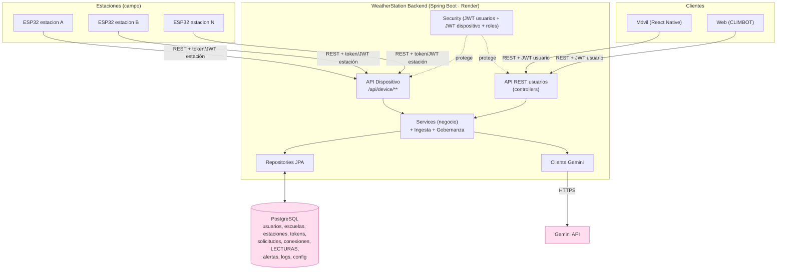

**Clave (v3)**: el ESP32 publica al backend; el backend valida y **persiste todo
en PostgreSQL** (datos del sistema + lecturas meteorológicas). Un único almacén,
una única frontera de confianza.

---

## 2. Arquitectura en capas

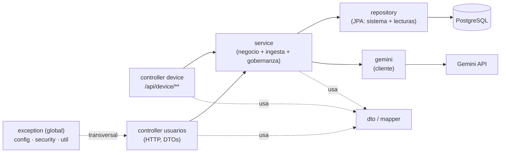

Dependencias unidireccionales; Gemini tras la interfaz `GeminiClient`. Las lecturas
viven en repositorios JPA (`LecturaActualRepository`, `LecturaRepository`).

---

## 3. Registro y aprobación de una estación

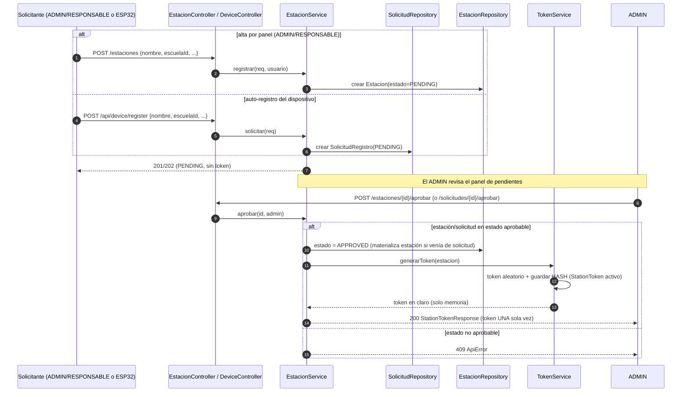

Rechazar/deshabilitar/reactivar siguen el mismo patrón cambiando `estado`.
`regenerar-token` revoca el `StationToken` activo y emite uno nuevo.

---

## 4. Autenticación del dispositivo — handshake (deliverable 12b)

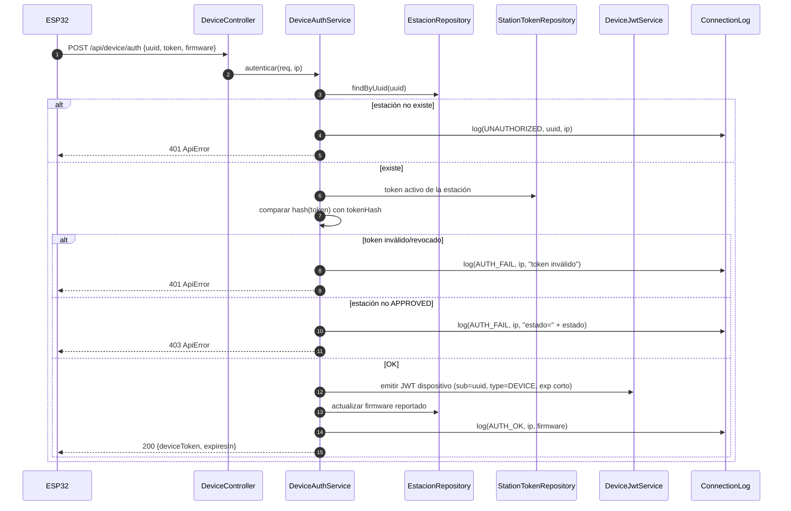

---

## 5. Ingesta de datos — el backend persiste en PostgreSQL (deliverable 13)

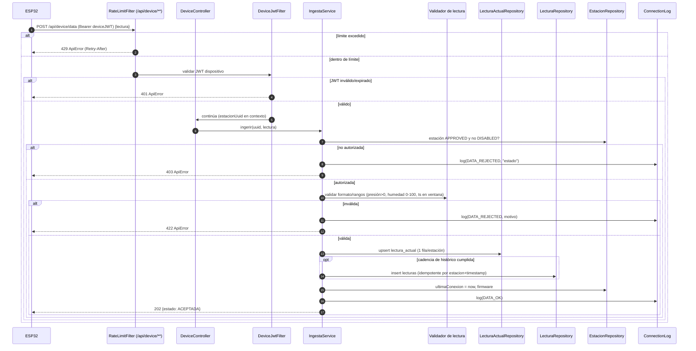

> Todo en una transacción de PostgreSQL: la lectura actual, el histórico (si toca)
> y la actualización de la estación se confirman juntos. El histórico es idempotente
> por `(estacion_id, timestamp)`.

---

## 6. Flujo de Autenticación de usuario — Login (deliverable 12)

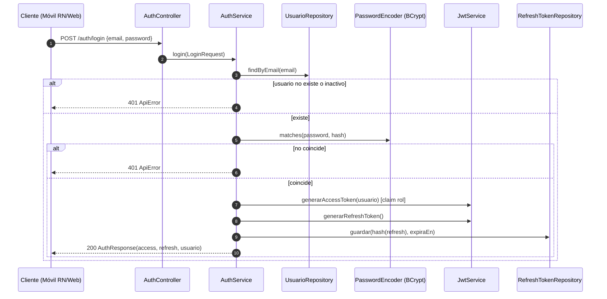

Acceso a endpoint protegido (rol) y refresh con rotación: como antes. El filtro JWT
distingue `type=DEVICE` y lo rechaza en rutas de usuario, y viceversa.

---

## 7. Flujo de Consulta de datos (lectura desde PostgreSQL)

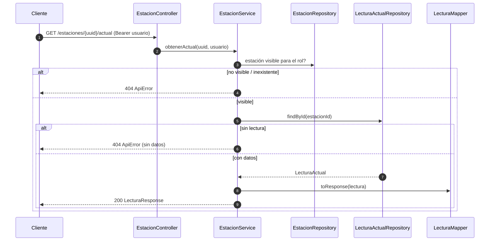

Historial: `LecturaRepository.findByEstacionAndTimestampBetween(...)` ordenado por
`timestamp`. Estadísticas: consulta de agregados SQL (`MIN/MAX/AVG`, `SUM`) sobre
`lecturas` en `EstadisticaService`.

---

## 8. Flujo completo de la IA (deliverable 11)

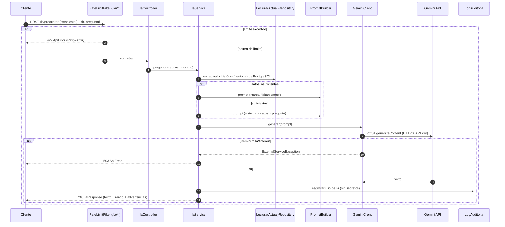

Prompt (grounded, principio VI): `[SYSTEM]` con reglas de no-invención + `[DATOS]`
de la estación + `[PREGUNTA]`.

---

## 9. Motor de Alertas (programado)

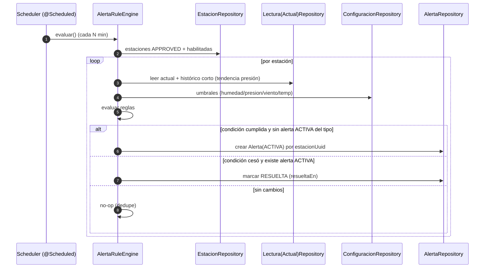

Reglas (FR-031): `humedad>90 ∧ presión↓` → **LLUVIA**; `viento_kmh>40` →
**VIENTO_FUERTE**; `temperatura>38` → **CALOR_EXTREMO**.

---

## 10. Ciclo de vida de una estación (máquina de estados)

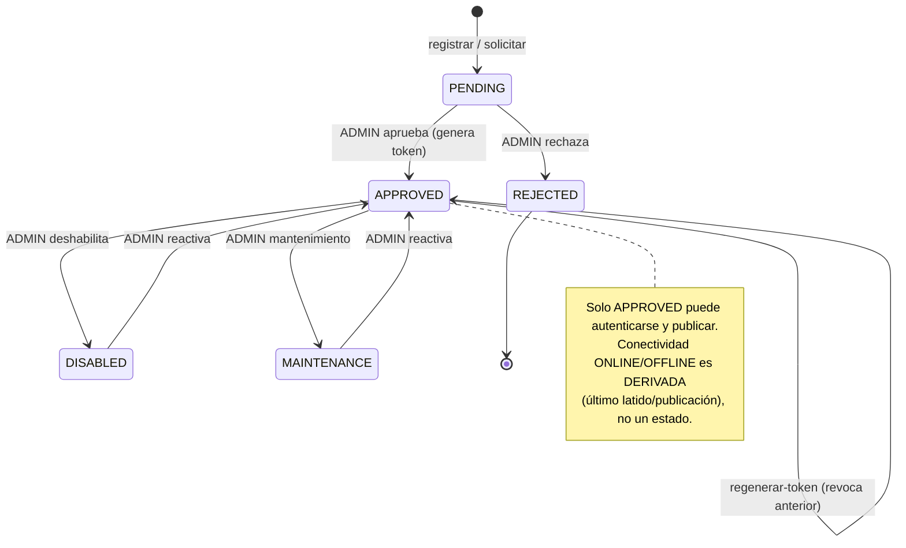

> **Latido y config**: una estación `APPROVED` envía `POST /api/device/heartbeat`
> (firmware/hardware/RSSI, sin batería) y obtiene `GET /api/device/config`
> (intervalo/muestreo/tz). El backend deriva `ONLINE`/`OFFLINE` del último latido y
> dispara `ESTACION_DESCONECTADA` al superar el umbral.
>
> **Acceso público**: `/api/public/**` (sin cuenta) sirve estaciones aprobadas,
> clima actual y stats agregadas; la IA queda detrás de autenticación.

---

## 11. Diagrama de despliegue (Render)

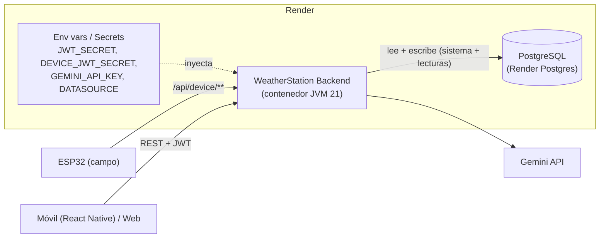
