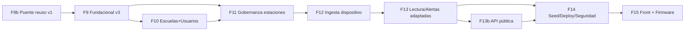

# Roadmap de Implementación: WeatherStation Backend v3 (deliverable 15)

**Input**: `spec.md`, `plan.md`, `research.md`, `data-model.md`, `contracts/`

**Organización**: tareas por fases. `[P]` = paralelizable (archivos distintos, sin
dependencias). `[USx]` = historia de usuario asociada.

**Estado**: specs **refactorizadas a v3** (arquitectura ESP32 → backend →
**PostgreSQL**, sin Firebase, + gobernanza de estaciones). Pendiente de aprobación
antes de implementar (principio II — SDD). El código v1 existe pero se **migra**.

---

## ⚠️ Cambio de arquitectura v1 → v3 (leer primero)

La v1 (ESP32 → Firebase → backend de solo lectura) está implementada y verificada
(Fases 0–8 abajo, conservadas como histórico). La v3 invierte el flujo de datos,
**retira Firebase** (todo en PostgreSQL) y añade la gobernanza de estaciones.
**Antes de escribir código nuevo**, esta es la clasificación de lo existente:

| Componente v1 | Veredicto v3 | Acción |
|---------------|--------------|--------|
| Auth de usuarios (JWT, refresh, roles) | ♻️ Reutilizar | Añadir rol `RESPONSABLE` + `escuela_id` en `Usuario` |
| Estadísticas/agregación | ♻️ Reutilizar | Pasar a agregados SQL sobre `lecturas` |
| IA (Gemini, grounded, rate limit) | ♻️ Reutilizar | Leer datos de Postgres; `estacionId` = uuid |
| Motor de alertas | ♻️ Reutilizar | Iterar estaciones APPROVED de PostgreSQL; leer de `lecturas` |
| Manejo de errores, OpenAPI, CORS, Docker, Render | ♻️ Reutilizar | Añadir esquemas/endpoints nuevos |
| `EstacionAdmin` (metadata opcional) | ♻️→❌ Reemplazar | Migrar a entidad `Estacion` con ciclo de vida |
| Adaptador Firebase + `firebase-admin` + identidad `/registro` | ❌ Retirar | Lecturas en Postgres (`lectura_actual`/`lecturas`); identidad en `Estacion` |
| Escritura de datos por el ESP32 | ❌ Retirar | La hace el backend vía `/api/device/data` (persiste en Postgres) |
| Front: panel admin (activar/desactivar) | ♻️ Ampliar | Añadir escuelas, registro/aprobación, tokens, conexiones |
| Firmware ESP32 (escribe Firebase) | ❌ Reescribir | Publicar a `/api/device/**`; retirar credenciales de Firebase |

Migración de BD: nueva versión Flyway `V3__red_estaciones.sql` (crea escuelas,
estaciones, station_tokens, solicitudes_registro, connection_logs, permisos,
**lectura_actual**, **lecturas**; migra `estaciones_admin`).

---

## Convención de rutas

Base: `WeatherStation_Backend/src/main/java/com/tony/wheatherstation/`.
Tests: `…/src/test/java/com/tony/wheatherstation/`.

---

## FASES NUEVAS v3 (a implementar tras aprobación)

### Fase 8b — Puente de reutilización v1 (hacer explícito el reuso)

> El código v1 cubre varios requisitos; esta fase lo deja como trabajo trazable
> para que `/speckit-implement` no lo omita por estar "reusado".

- [x] T0a Verificar/adaptar los módulos v1 reutilizados y dejarlos alineados a v3:
      ✅ **2026-06-28**: baseline verde (`./mvnw -DskipTests compile` → EXIT 0, 93
      clases, Java 21). Todos los módulos presentes (auth, IA, alertas, usuarios,
      consulta, transversales). Pendientes confirmados para fases posteriores:
      `Rol` tiene 3 valores → +`RESPONSABLE` (T108); `SecurityConfig` necesita
      reglas para device/público/gobernanza e IA-requiere-cuenta (T118/T130c);
      consulta lee Firebase → migrar a Postgres (T127/T128); motor de alertas →
      T129. Sin cambios de código en esta fase (solo verificación de la línea base).
      - **Auth de usuarios** (FR-001..006): JWT/refresh/roles intactos; añadir
        `ROLE_RESPONSABLE` (ver T108).
      - **Consulta de datos** (FR-022,023): los endpoints `GET /estaciones/{id}`,
        `/actual`, `/historial`, `/ultimas24h`, `/estadisticas` siguen vivos pero
        leyendo de Postgres (se cablean en T127/T128).
      - **IA** (FR-024..029): `IaController`/rate limit intactos; `IaService` lee de
        Postgres (T128).
      - **Alertas-API** (FR-032): `AlertaController` filtros intactos; el motor se
        adapta en T129.
      - **Usuarios/transversales** (FR-033,034,035..039): CRUD usuarios,
        `GlobalExceptionHandler`, OpenAPI, CORS — confirmar que siguen pasando.

**Checkpoint**: el reuso de v1 está verificado y enganchado a la nueva identidad.

### Fase 9 — Fundacional v3 (esquema + entidades de la red) ✅ ⚠️ bloqueante

> ✅ **2026-06-28**: compila (EXIT 0, 123 clases) y las migraciones `V1→V2→V3`
> aplican limpio en PostgreSQL 16 (15 tablas; seeds config 9 / permisos 4 /
> rol_permisos 7; `lecturas` con UNIQUE + índice + FK). Firebase se **conserva**
> hasta la Fase 13 para no romper el build (T105b reubicado allí).

- [x] T101 Migración Flyway `V3__red_estaciones.sql`: tablas `escuelas`,
      `estaciones`, `station_tokens`, `solicitudes_registro`, `connection_logs`,
      `permisos`, `rol_permisos`, **`lectura_actual`**, **`lecturas`** (con
      `UNIQUE (estacion_id, medido_en)` e índices); `usuarios.escuela_id`. (Se
      conserva `estaciones_admin` durante la transición; se retira en Fase 13.)
- [x] T102 [P] Entidades JPA + enums nuevos (`Escuela`, `Estacion`, `StationToken`,
      `SolicitudRegistro`, `ConnectionLog`, `Permiso`, `LecturaActual`, `Lectura`;
      `EstadoEstacion`+`MAINTENANCE`, `Conectividad`, `EstadoSolicitud`,
      `EventoConexion`); ampliar `Usuario` (escuela) y `Rol` (+`RESPONSABLE`).
- [x] T103 [P] Repositorios JPA nuevos (`EscuelaRepository`, `EstacionRepository`,
      `StationTokenRepository`, `SolicitudRepository`, `ConnectionLogRepository`,
      `PermisoRepository`, `LecturaActualRepository`, `LecturaRepository`).
- [x] T104 [P] `TokenGenerator` (SecureRandom, prefijo `stk_`, hash SHA-256).
- [x] T105 [P] `UnauthorizedStationException` (+ handler en `GlobalExceptionHandler`);
      códigos `ESTACION_NO_APROBADA`/`TOKEN_ESTACION_INVALIDO`/`LECTURA_INVALIDA`
      se emiten al lanzarla en fases posteriores.
- [ ] T105b ➡️ **reubicado a la Fase 13**: retirar `firebase-admin`, `FirebaseConfig`
      y el adaptador Firebase cuando la consulta lea de Postgres (evita romper el
      build entre fases).

**Checkpoint**: ✅ esquema v3 creado y verificado en Postgres; entidades y repos
compilando. Firebase sigue activo (se retira en Fase 13).

### Fase 10 — Escuelas + ampliación de usuarios (P2) [US8] ✅

> ✅ **2026-06-28**: compila (128 clases) y **smoke test verde** contra Postgres +
> Firebase reales: login admin, `POST/GET /escuelas` (totalEstaciones=0), clave
> duplicada→409, RESPONSABLE sin escuelaId→400 `ESCUELA_REQUERIDA`, RESPONSABLE con
> escuelaId→201 (escuelaNombre), borrar escuela vacía→204, `/escuelas` sin token→401.
> Flyway aplicó V1→V3 al arrancar. (Tests automatizados: en la pasada de testing.)

- [x] T106 [P][US8] DTOs escuela (`EscuelaRequest`, `EscuelaResponse`) + `EscuelaMapper`.
- [x] T107 [US8] `EscuelaService` (CRUD, clave única, guard de borrado si tiene
      estaciones) + `EscuelaController` (`/escuelas/**`); escritura ADMIN en `SecurityConfig`.
- [x] T108 [US8] `UsuarioService`/DTOs con `escuelaId` (obligatorio si RESPONSABLE,
      `ESCUELA_REQUERIDA`); `RESPONSABLE`→`ROLE_RESPONSABLE` ya lo mapean el filtro
      JWT y `CustomUserDetailsService` (sin cambios extra).
- [~] T109 [P][US8] Verificado por smoke test E2E; tests JUnit automatizados pendientes
      para la fase de testing.

**Checkpoint**: ✅ escuelas y el nuevo rol operativos y verificados en runtime.

### Fase 11 — Gobernanza de estaciones (P1) 🎯 [US2, US8] ✅

> ✅ **2026-06-28**: compila (145 clases) y **smoke test verde** contra Postgres +
> Firebase reales: registrar→PENDING, aprobar→token `stk_` (una vez), re-aprobar→409,
> regenerar→token distinto (viejo revocado, hashes en BD), mantenimiento/reactivar/
> deshabilitar (transiciones), conexiones 200, RESPONSABLE registra solo en su
> escuela (otra→403) y no puede aprobar (403). Nombres con prefijo `Station*` para
> no colisionar con las clases `Estacion*` de v1 (se unifican al retirar Firebase
> en Fase 13).

- [x] T110 [P][US2] DTOs (`EstacionRegistroRequest`, `EstacionUpdateRequest`,
      `EstacionAccionRequest`, `StationResponse`, `StationTokenResponse`,
      `ConexionResponse`, `SolicitudResponse`) + `StationMapper`/`ConexionMapper`/
      `SolicitudMapper`.
- [x] T111 [US2] `StationTokenService` (generar/hash SHA-256/rotar/revocar; un activo
      por estación).
- [x] T112 [US2] `StationService` (registrar PENDING, aprobar→APPROVED+token,
      rechazar, deshabilitar, mantenimiento, reactivar, regenerar; máquina de estados
      con guardas 409 + autorización por propiedad de escuela vía `CurrentUserService`).
- [x] T113 [US2] `ConnectionLogService` (`registrar` para Fase 12 + `listar`) +
      `GET /estaciones/{id}/conexiones`.
- [x] T114 [US2] `StationController` (`POST /estaciones`, `PUT/DELETE /{id}`,
      `/aprobar` `/rechazar` `/deshabilitar` `/reactivar` `/mantenimiento`
      `/regenerar-token` `/conexiones`); reglas de rol en `SecurityConfig`.
- [x] T115 [US8] `SolicitudService` + `SolicitudController` (`/solicitudes/**`;
      aprobar materializa estación + token). Creación de solicitudes vía
      `/api/device/register` (Fase 12); `GET /solicitudes` verificado.
- [~] T116 [P][US2] Verificado por smoke test E2E; tests JUnit a la pasada de testing.

**Checkpoint**: ✅ gobernanza de estaciones operativa y verificada en runtime.

### Fase 12 — Ingesta de datos del dispositivo (P1) 🎯 [US3] ✅

> ✅ **2026-06-28**: compila (160 clases) y **smoke test E2E verde** contra Postgres +
> Firebase reales — flujo completo register→aprobar→device-auth→data→persistencia:
> data válida→202, inválida (presión 0)→422 LECTURA_INVALIDA, auth token malo→401,
> rotación invalida el token viejo→401, JWT de usuario en `/api/device/data` rechazado
> (aislamiento), heartbeat→204 (RSSI/hw/fw en BD), config→intervalo/muestreo/zona,
> `device/register`→solicitud PENDING→aprobar→token, conexiones auditadas. **Fix
> aplicado**: los logs de conexión de FALLO (`AUTH_FAIL`/`DATA_REJECTED`/`UNAUTHORIZED`)
> usan `@Transactional(REQUIRES_NEW)` para sobrevivir al rollback de la operación.

- [x] T117 [US3] `DeviceJwtService` (HS256 con `DEVICE_JWT_SECRET`, claim `type=DEVICE`).
- [x] T118 [US3] `DeviceJwtFilter` (corre tras el de usuario; limpia el contexto en
      `/api/device/**` y solo concede `ROLE_DEVICE`) + reglas en `SecurityConfig`.
- [x] T119 [P][US3] DTOs dispositivo (auth/data/heartbeat/config request+response).
- [x] T120 [US3] `DeviceAuthService` (handshake: uuid+token(hash)+estado; logs
      AUTH_OK/AUTH_FAIL; 401 genérico para credenciales, 403 si no APPROVED).
- [x] T121 [US3] `LecturaValidator` (rangos/finitud/ventana de timestamp → 422).
- [x] T122 [US3] Persistencia: `LecturaActualRepository` (upsert por PK estación) +
      `LecturaRepository` (histórico idempotente + `findTop...` para la cadencia).
- [x] T123 [US3] `IngestaService` (valida estado+lectura → upsert actual + histórico
      por cadencia → ultimaConexion → log), transaccional.
- [x] T124 [US3] `DeviceController` (`/register|auth|data|heartbeat|config`).
- [x] T125 [US3] `DeviceRateLimitInterceptor` (`/api/device/**` por uuid/IP) → 429.
- [x] T125b [US3] `HeartbeatService` + `POST /api/device/heartbeat` (fw/hw/RSSI,
      **sin batería**) → ultimaConexion + log HEARTBEAT.
- [x] T125c [US3] `DeviceConfigService` + `GET /api/device/config`.
- [~] T126 [P][US3] Verificado por smoke test E2E; tests JUnit a la pasada de testing.

**Checkpoint**: ✅ las estaciones publican datos vía backend; todo persistido en
Postgres y verificado en runtime. **El flujo nuevo de datos funciona de punta a
punta.** (US4 consulta sigue leyendo Firebase en v1 hasta la Fase 13.)

### Fase 13 — Adaptación de lectura, estadísticas y motor a Postgres ✅

> ✅ **2026-06-28**: compila (154 clases) y **smoke verde** — la app **arranca SIN
> credenciales de Firebase** (prueba de la retirada), Flyway aplica V4 (drop
> `estaciones_admin`) y V5. Consulta lee de Postgres (`GET /estaciones` con
> `ultimaLectura`+`conectividad`, `/actual`, `/historial`, `/estadisticas`),
> `/estadisticas` avanzadas (RED/buckets), IA declara falta de datos sin Gemini, y
> el motor genera `ESTACION_DESCONECTADA` para una estación aprobada sin datos.
> **Bug corregido**: `alertas.tipo` era `VARCHAR(20)` y `ESTACION_DESCONECTADA`
> mide 21 → migración `V5` amplía a `VARCHAR(30)`.

- [x] T127 `EstacionConsultaService` (Postgres): resuelve por `uuid` con visibilidad
      por rol (APPROVED para todos; demás estados solo ADMIN/RESPONSABLE de la
      escuela) y lee de `lectura_actual`/`lecturas` vía `WeatherDataService`.
      `EstacionController` reescrito (lee Postgres, `{id}`=uuid). `StationResponse`
      gana `ultimaLectura`.
- [x] T128 `EstadisticaService` (reutilizado sobre `LecturaMeteorologica`);
      `IaService` lee de Postgres (`WeatherDataService`, resuelve por uuid).
- [x] T128b Estadísticas **avanzadas** `GET /estadisticas?agrupacion=DIA|MES` por
      estación/escuela/municipio/red (`EstadisticaAvanzadaService`, bucketing en
      memoria) + DTO `EstadisticaAgrupadaResponse` + `EstadisticaController`.
- [x] T129 `AlertaRuleEngine` itera estaciones APPROVED de Postgres, lee de
      `lecturas`, referencia el uuid; **alertas de salud** `ESTACION_DESCONECTADA`
      y `SENSOR_SIN_RESPUESTA` (**sin batería**).
- [x] T129c Retirados `firebase-admin` (pom), `FirebaseConfig`, paquete `firebase/`,
      `EstacionAdmin`/repo/service/DTOs, props `app.firebase`; tabla
      `estaciones_admin` eliminada (V4). **Backend 100% sin Firebase.**
- [~] T130 [P] Verificado por smoke E2E; tests JUnit a la pasada de testing.

**Checkpoint**: ✅ lectura, estadísticas, IA y alertas (meteo + salud) sobre
Postgres; **Firebase retirado por completo** y verificado en runtime.

### Fase 13b — API pública sin cuenta (P2) [US9] ✅

> ✅ **2026-06-28**: compila (159 clases) y **smoke verde** (sin token):
> `/api/public/stations` devuelve solo APPROVED (una PENDING NO aparece),
> `/weather/latest` con última lectura, `/statistics?municipio=` con agregados;
> `POST /ia/preguntar` sin cuenta → **401**, `GET /estaciones` y `/usuarios` sin
> cuenta → **401**.

- [x] T130a [US9] DTOs públicos (`PublicEstacionResponse`, `PublicEstadisticaResponse`).
- [x] T130b [US9] `PublicService` + `PublicController` (`/api/public/stations`,
      `/weather/latest`, `/statistics`) — solo lectura, sin IA, solo estaciones
      APPROVED, datos no sensibles.
- [x] T130c [US9] `SecurityConfig`: `/api/public/**` `permitAll` + rate limiting por
      IP (reusa el limitador de dispositivo); `/ia/**` confirmado tras autenticación.
- [~] T130d [P][US9] Verificado por smoke; tests JUnit a la pasada de testing.

**Checkpoint**: ✅ red visible públicamente sin exponer IA ni gestión.

**Checkpoint**: red visible públicamente sin exponer IA ni gestión.

### Fase 14 — Seed, despliegue y seguridad v3 ✅

> ✅ **2026-06-28**: despliegue y seguridad al día sin Firebase. Swagger publica
> **38 rutas** (device 5, public 3, escuelas, solicitudes, estadísticas, estaciones
> 13). **Rendimiento holgado** (p95 local): `/actual` 14 ms, `/historial` 24h 18 ms,
> ingesta 4 ms — muy por debajo de SC-006/007. Revisión de seguridad OK.

- [~] T131 Seed: ADMIN sembrado al arranque; claves `device.*`/`ingesta.*` ya
      seedadas en V3. Escuela/RESPONSABLE demo: opcional vía API (no se siembra en prod).
- [x] T132 [P] `render.yaml` y `DEPLOY.md`: añadido `DEVICE_JWT_SECRET` (autogenerado);
      **retiradas** `FIREBASE_*` y toda referencia al Admin SDK; documentadas las env
      de dispositivo/ingesta.
- [x] T133 Revisión de seguridad: token de estación **nunca** logueado en claro (solo
      hash en BD); `firebase-admin` fuera del pom; `.gitignore`/`.dockerignore` cubren
      secretos. ⚠️ pendiente del usuario: rotar el token legacy de Firebase (consola)
      y retirar de `WeatherStation_ESP32/*.txt` (desaparece al reescribir el firmware).
- [x] T134 Swagger/OpenAPI publica el 100% de los endpoints (38 rutas);
      `OpenApiConfig` a versión 3.1.0 (sin mención a Firebase).
- [x] T134b Rendimiento (SC-006/007): p95 `/actual` 14 ms, `/historial` 24h 18 ms,
      ingesta 4 ms (local). Índice `(estacion_id, medido_en DESC)` en `lecturas` ✓.
- [x] T135 Flujo `quickstart` v3 ejecutado E2E múltiples veces (registro→aprobación→
      device-auth→data→consulta) en las verificaciones de las fases 11–14.

**Checkpoint**: ✅ backend v3 listo para desplegar en Render (sin Firebase, con
`DEVICE_JWT_SECRET`), Swagger completo y rendimiento holgado. **Backend COMPLETO.**

## 🏁 BACKEND v3 COMPLETO
Fases 8b–14 implementadas y **verificadas en runtime** contra PostgreSQL real. El
backend es 100% PostgreSQL (sin Firebase): gobernanza de estaciones, ingesta del
dispositivo, consulta/IA/alertas/estadísticas, tier público y despliegue. Falta solo
la **Fase 15** (front CLIMBOT + firmware ESP32), que son componentes separados.

### Fase 15 — Migración del front CLIMBOT y del firmware (coordinada) ✅

> ✅ **2026-06-28**: front migrado a la API v3 y **compila** (`npm run build` →
> EXIT 0, ✓ built). Tipos/queries/displays adaptados (`Estacion`→`StationResponse`
> con uuid/estado/conectividad, rutas por uuid). Firmware v3 escrito como archivo
> nuevo (pines/sensores/BLE intactos; Firebase→REST).

- [x] T136 Front: panel de **escuelas** (`EscuelasPage` CRUD) + `useEscuelas`/mutaciones.
- [x] T137 Front: **registro/aprobación** de estaciones (`EstacionesPage` reescrita:
      registrar, aprobar/rechazar/mantenimiento/deshabilitar/reactivar) + **modal de
      token mostrado una vez con copia**; `SolicitudesPage` (aprobar/rechazar device).
- [x] T138 Front: **regenerar token** (modal) e **historial de conexiones** (modal);
      conectividad ONLINE/OFFLINE y estado en las tablas/cards.
- [x] T139 Front: rol **RESPONSABLE** (`AuthContext.esResponsable`, `/admin` abierto a
      RESPONSABLE; pestañas usuarios/escuelas solo ADMIN; backend gatea por escuela).
- [x] T139b Front: **vista pública sin cuenta** (`PublicoPage`, ruta `/publico`,
      enlace desde login) contra `/api/public/**`, **sin IA**.
- [x] T140 Firmware ESP32 v3 (`ESTACION1_ESP32_v3.txt`): pines/sensores/BLE/OLED/NTP
      **sin cambios**; quitado Firebase; `obtenerDeviceToken()` (handshake) +
      `enviarLectura()` (`/api/device/data`) + `enviarHeartbeat()`; intervalo de envío
      **60 s**. Provisión de uuid+token por `#define` (BLE más adelante). (Se entrega
      como archivo nuevo; el usuario lo flashea y prueba en hardware.)

**Checkpoint**: ✅ plataforma multi-escuela completa de extremo a extremo (backend
verificado en runtime, front compilando, firmware listo para flashear).

### Fase 15b — Solicitud de token por usuarios regulares (P2) ✅

> **2026-06-28**: implementado. Usuarios autenticados (USUARIO) pueden solicitar
> un token para su estación desde el front. El ADMIN aprueba/rechaza desde el
> panel existente; al aprobar se envía el token por email al solicitante.

- [x] T141 Dependencia `spring-boot-starter-mail` + configuración SMTP en
      `application.yaml` (SMTP_HOST/USER/PASS).
- [x] T142 Flyway V6: `solicitudes_registro.escuela_id` nullable + columna
      `institucion` (texto libre del solicitante).
- [x] T143 `SolicitudRegistro` entity: `escuela` nullable + campo `institucion`.
- [x] T144 `SolicitudResponse`: añadir `institucion`, `solicitanteNombre`,
      `solicitanteEmail`.
- [x] T145 `SolicitudMapper`: mapear nuevos campos.
- [x] T146 `SolicitudCrearRequest` DTO (nombre, institucion, ubicacion, municipio,
      latitud, longitud, firmware).
- [x] T147 `SolicitudRepository`: `findBySolicitanteIdOrderByCreatedAtDesc`.
- [x] T148 `EmailService`: `enviarToken(to, stationName, token)` y
      `enviarRechazo(to, stationName, motivo)` vía Jakarta Mail sobre SMTP.
- [x] T149 `SolicitudService.crearDesdeUsuario`: crea solicitud PENDING con
      `solicitante=currentUser`, `escuela=null`, `institucion=req.institucion()`.
- [x] T149b `SolicitudService.misSolicitudes`: retorna solicitudes del usuario actual.
- [x] T149c `SolicitudService.aprobar`: si `escuela==null` e `institucion!=null`,
      auto-crea `Escuela` temporal; envía email con token al solicitante.
- [x] T149d `SolicitudService.rechazar`: envía email de rechazo al solicitante.
- [x] T149e `SolicitudService.listar`: si actor es USUARIO, delega a `misSolicitudes()`.
- [x] T150 `SolicitudController`: `POST /solicitudes` y `GET /solicitudes/mis-solicitudes`.
- [x] T151 `SecurityConfig`: POST /solicitudes y GET /solicitudes/mis-solicitudes
      accesibles a cualquier autenticado.
- [x] T152 Front: `types.ts` extiende `Solicitud` con `institucion`,
      `solicitanteNombre`, `solicitanteEmail`.
- [x] T153 Front: `adminQueries.ts` — `useSolicitarEstacion`, `useMisSolicitudes`.
- [x] T154 Front: `SolicitarEstacionPage.tsx` — formulario + tabla "Mis solicitudes".
- [x] T155 Front: `HomePage.tsx` — banner "Solicitar mi estación" para usuarios
      no-admin. `App.tsx` — ruta `/solicitar-estacion`.
- [x] T156 Front: `SolicitudesPage.tsx` admin — columna "Solicitante".
- [x] T157 Specs actualizadas (spec.md, plan.md, tasks.md) con la nueva funcionalidad.

## 🏁🏁 PIVOTE v3 COMPLETO (todas las fases)
Backend (8b–14, verificado en runtime), front (15, compila) y firmware (15, escrito).
Pendiente del usuario: desplegar en Render, flashear el firmware con uuid+token de una
estación aprobada, y rotar el token legacy de Firebase en la consola.

---

## Dependencias y orden (v3)

- **F8b** ancla el reuso de v1 (auth, IA, consulta, alertas-API) como trabajo explícito.
- **F9** es bloqueante (esquema + entidades).
- **F11** (gobernanza) habilita **F12** (sin estaciones aprobadas no hay tokens).
- **F13b** (pública) depende de la lectura/estadísticas adaptadas en F13.
- **MVP v3** = F8b+F9+F10+F11+F12.

## Trazabilidad (resumen v3)

| Historia | Requisitos | Endpoints | Fase |
|----------|-----------|-----------|------|
| US1 | FR-001..006 | `/auth/**` | reuso v1 → **T0a** |
| US2 | FR-009..013 | `/estaciones` + `/aprobar` `/rechazar` `/mantenimiento` … | 11 |
| US3 | FR-017..021, **FR-040,041** | `/api/device/**` (data, **heartbeat**, **config**) | 12 |
| US4 | FR-022,023 | `/estaciones/{id}` `/actual` | 13 (adaptado T127) |
| US5 | FR-023, **FR-032b** | `/historial` `/ultimas24h` `/estadisticas` (+ avanzadas) | 13 (T128, T128b) |
| US6 | FR-024..029 | `/ia/**` | reuso v1 → **T0a** (lee Postgres, T128) |
| US7 | FR-030..032 | `/alertas/**` | 13 (T129, reuso API) |
| US8 | FR-007,008,014,016,033 | `/escuelas/**` `/solicitudes/**` `/usuarios/**` `/conexiones` | 10, 11 |
| **US9** | **FR-042,043** | **`/api/public/**`** (sin IA) | **13b** |
| Transversal | FR-034,035..039 | (todos) | 9, 14, **T0a** |

## Notas

- No añadir dependencias nuevas: el stack de v1 cubre v3 (research.md resumen).
- Verificar cada checkpoint antes de avanzar (entrega incremental).
- El token de estación en claro solo se devuelve una vez; nunca se persiste ni
  loguea (invariante de seguridad, data-model.md E).

---

---

# ARCHIVO HISTÓRICO — Roadmap v1 (completado, base de la migración)

> Las fases 0–8 corresponden a la arquitectura v1 (ESP32 → Firebase → backend de
> solo lectura). Quedan como referencia; su código se reutiliza/migra según la
> tabla "Cambio de arquitectura v1 → v3" de arriba.

- ✅ **Fase 0 (Setup)** — dependencias, perfiles, OpenAPI, CORS, estructura.
- ✅ **Fase 1 (Fundacional)** — Flyway V1+V2 (7 tablas), entidades, errores, repos.
- ✅ **Fase 2 (US1 — Auth JWT)** — register/login/refresh+rotación, roles, seed ADMIN.
- ✅ **Fase 3 (US2 — Clima actual)** — lectura de `/registro` y `/{id}/actual`.
- ✅ **Fase 4 (US3 — históricos/24h/estadísticas)** — rango, agregados.
- ✅ **Fase 5 (US4 — IA con Gemini)** — grounded + rate limit + 503.
- ✅ **Fase 6 (US5 — alertas)** — `@Scheduled`, dedup/resolución.
- ✅ **Fase 7 (US6 — admin)** — CRUD usuarios + metadata `EstacionAdmin`.
- ✅ **Fase 8 (pulido/despliegue)** — Docker, `render.yaml`, `DEPLOY.md`, smoke test.

**Ajustes posteriores v1**: CORS para el front (5173/4173); activar/desactivar
estaciones (`EstacionAdmin.habilitada`). El front CLIMBOT (React+Vite+TS) consume
la API v1. Todo ello es la base sobre la que se construye v3.
